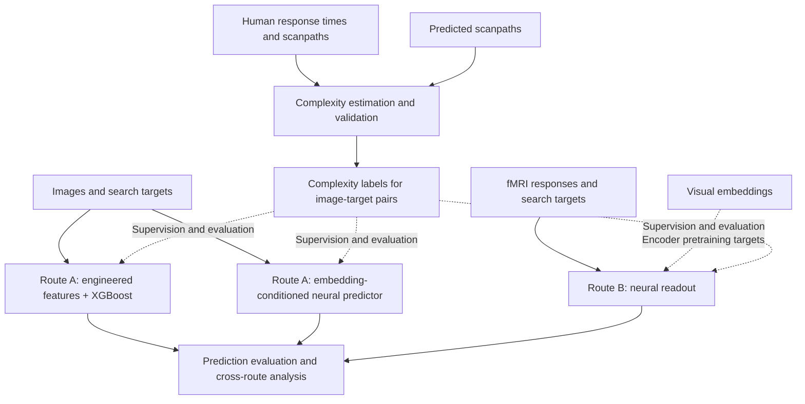

# Where does complexity live?

**A cross-level bridge for measuring task-specific visual complexity**

Sabrina Patania†, Riccardo Chimisso†, Francesco Uccelli, Valentyn Piskovskyi,
Marco Fagnani, and Dimitri Ognibene

Department of Psychology, University of Milan-Bicocca, Italy

† Equal contribution

Companion code repository for the paper accepted by the
*International Journal of Computer Vision (IJCV)*.

## Overview

How difficult is it to find a particular object in an image? The answer depends on
both the scene and the search target. This work studies visual search complexity
as a property of **image-target pairs**, grounded in human search behaviour, and
asks how that complexity is reflected in eye movements, image representations,
and brain activity.

Starting from human response times and fixation counts in COCO-Search18, we
estimate a target-conditioned complexity index using hierarchical statistical
models. We assess the stability of the resulting difficulty rankings and examine
whether predicted scanpaths can provide a scalable substitute for human gaze.
We then investigate two routes for predicting the resulting complexity scores:

- **Route A - stimulus readout:** predict complexity from image content and the
  search target, using either engineered features with XGBoost or a neural
  predictor operating on DINOv2 and CLIP embeddings.
- **Route B - neural readout:** predict complexity from Natural Scenes Dataset
  (NSD) fMRI responses and the search target, using an encoder pretrained to
  predict visual embeddings and a target-conditioned complexity head.

The fMRI responses were recorded during viewing of the images; the search target
is supplied separately to the predictor. This distinction matters when
interpreting neural readout of task-specific complexity.


*Figure 2 from the paper: complexity readout routes. Both routes condition their
prediction on the search target.*

## Repository status

The [engineered Route A component](route_a/engineered/README.md) provides a
train-and-predict workflow for image-target complexity scores. It extracts
target-conditioned image features, fits an XGBoost regressor, and saves the
complete preprocessing and model bundle for later inference. The other research
components described in the paper are being prepared separately.

A pretrained model bundle is not published yet. To make predictions, first train
one from labeled image-target pairs. Datasets, pretrained image-model weights,
and trained bundles are external to this repository.

## Quick start: engineered Route A

Use Python 3.10 or newer. From the repository root:

```bash
python3 -m venv .venv
source .venv/bin/activate
python -m pip install -e '.[engineered]'
python -m route_a.engineered train --data labels.csv --image-root /path/to/images --out model_bundle/
python -m route_a.engineered predict --model model_bundle/ --image /path/to/images/example.jpg --target chair
```

Replace `labels.csv` and image paths with your data. The
[Route A guide](route_a/engineered/README.md) explains the input CSV, batch
prediction, model setup, and Python API. COCO-Search18 and NSD are separate
training sources; [data setup](docs/data_setup.md#coco-search18-versus-nsd)
explains their adapters, paths, and weights.

## Scientific workflow



Visual image embeddings anchor Route B during encoder pretraining. At inference,
its complexity prediction uses fMRI, subject identity, and target conditioning.

## Repository structure

```text
where-does-complexity-live/
├── README.md
├── route_a/
│   └── engineered/
│       ├── README.md
│       └── ...              # Engineered features and XGBoost
└── docs/
    └── ...                  # Data setup and code conventions
```

| Component | Purpose and release status |
| --- | --- |
| `route_a/engineered/` | Feature-based image-target training and inference. |
| `docs/` | Input data and development conventions. |

The accepted paper also covers hierarchical complexity labels, an
embedding-conditioned Route A model, Route B neural readout, and cross-route
analysis. Those workflows are outside the current engineered Route A interface.

## Data and reproducibility

The study uses COCO-Search18, MS-COCO, and NSD. The engineered Route A component
reads image paths and supplied complexity labels; it does not calculate labels
from behavior. See [data setup](docs/data_setup.md) for the canonical CSV schema
and dataset adapters. Large datasets, extracted features, and trained bundles
belong outside Git.

## Development

See the [Python code style guide](docs/code_style.md) for formatting, reST
docstrings, typing, and imports. [EditorConfig](.editorconfig) supplies basic
whitespace settings for compatible editors; the remaining conventions are
documented for authors and reviewers.

## Paper and citation

**Where does complexity live? A cross-level bridge for measuring task-specific
visual complexity.** Sabrina Patania, Riccardo Chimisso, Francesco Uccelli,
Valentyn Piskovskyi, Marco Fagnani, and Dimitri Ognibene. Accepted by
*International Journal of Computer Vision*.

A public paper link and machine-readable citation will be added when available.
