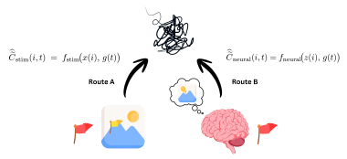
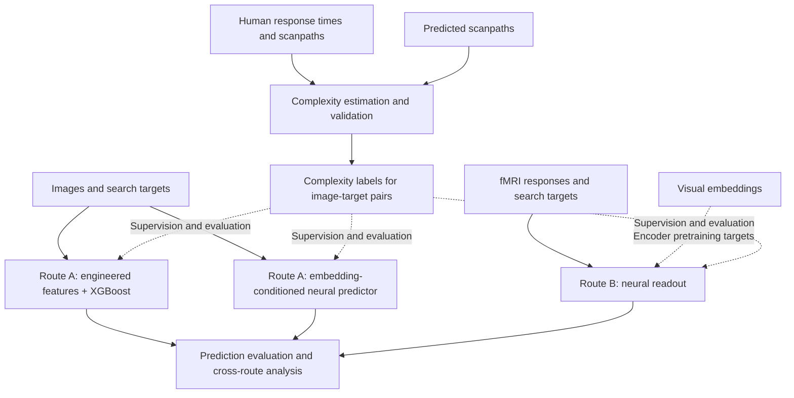

# Where does complexity live?

**A cross-level bridge for measuring task-specific visual complexity**

Sabrina Patania†, Riccardo Chimisso†, Francesco Uccelli, Valentyn Piskovskyi,
Marco Fagnani, and Dimitri Ognibene

Department of Psychology, University of Milan-Bicocca, Italy

† Equal contribution

Companion research repository for the manuscript submitted to the
*International Journal of Computer Vision (IJCV)*.

## Overview

How difficult is it to find a particular object in an image? The answer depends on
both the scene and the search target. This work studies visual search complexity
as a property of **image-target pairs**, grounded in human search behaviour, and
asks how that complexity is reflected in eye movements, image representations,
and brain activity.

Starting from human response times and fixation counts in COCO-Search18, we
estimate a target-conditioned complexity index using hierarchical statistical
models. We assess the stability of the resulting difficulty rankings and examine
whether predicted scanpaths can provide a scalable substitute for human gaze.
We then investigate two routes for predicting the resulting complexity scores:

- **Route A - stimulus readout:** predict complexity from image content and the
  search target, using either engineered features with XGBoost or a neural
  predictor operating on DINOv2 and CLIP embeddings.
- **Route B - neural readout:** predict complexity from Natural Scenes Dataset
  (NSD) fMRI responses and the search target, using an encoder pretrained to
  predict visual embeddings and a target-conditioned complexity head.

The fMRI responses were recorded during viewing of the images; the search target
is supplied separately to the predictor. This distinction matters when
interpreting neural readout of task-specific complexity.



*Figure 2 from the paper: complexity readout routes. Both routes condition their
prediction on the search target.*

## Repository status

This repository is being prepared as the cleaned research code release for the
paper. The [complexity component](complexity/README.md) now contains organized,
renamed copies of the relevant research scripts and a preserved NSD ranking.
Script contents are unchanged, and full-flow reproduction is still pending.
The other components in the layout below remain planned. Installation instructions,
experiment configurations, and reproduction commands will be added as each
component is prepared and checked.

## Scientific workflow



Visual image embeddings anchor Route B during encoder pretraining. At inference,
its complexity prediction uses fMRI, subject identity, and target conditioning.

## Repository structure

```text
where-does-complexity-live/
├── README.md
├── complexity/
│   ├── README.md
│   └── ...                  # Complexity estimation, rankings, and validation
├── route_a/
│   ├── README.md
│   ├── engineered/
│   │   ├── README.md
│   │   └── ...              # Engineered features and XGBoost
│   └── embedding/
│       ├── README.md
│       └── ...              # Embedding-conditioned predictor (Fig. 5)
├── route_b/
│   ├── README.md
│   └── ...                  # fMRI preprocessing, pretraining, and readout
├── shared/
│   └── ...                  # Reused data, embedding, model, and evaluation code
├── analysis/
│   ├── README.md
│   └── ...                  # Cross-route comparisons and variance analysis
└── docs/
    └── ...                  # Data setup, reproduction, and code conventions
```

| Component | Purpose and relation to the paper |
| --- | --- |
| `complexity/` | Prepare behavioural and predicted-gaze data, fit complexity models, generate labels, and evaluate ranking stability. |
| `route_a/engineered/` | Implement feature-based stimulus prediction (§5.5.1), feature comparisons, and the related fMRI augmentation experiments (§5.6). |
| `route_a/embedding/` | Implement embedding-conditioned stimulus prediction (§5.6.1, Fig. 5), including its feature-family experiments. |
| `route_b/` | Implement the fMRI pipeline (§5.7, Fig. 7) and its encoder-objective experiments (Fig. 9). |
| `shared/` | Hold code reused across components, such as embedding extraction, target conditioning, split utilities, and metrics. |
| `analysis/` | Compare route outputs and quantify recovery of target-driven variance (§5.8). |
| `docs/` | Document data preparation, reproducibility, and development conventions. |

The Fig. 5 pipeline belongs to Route A because it predicts from image embeddings.
It shares conditioning and uncertainty modelling with Route B, providing a
comparable stimulus-based counterpart to the neural readout.

Each component README will describe its scientific purpose, required inputs,
produced outputs, and commands for reproducing the corresponding paper results.
Experiment-specific configurations and ablations will live with their owning
component; reusable implementations will live in `shared/`.

## Data and reproducibility

The study uses COCO-Search18, MS-COCO, and NSD. Data-access and preparation
instructions will accompany the released pipelines. Large datasets, extracted
embeddings, and model checkpoints will be stored separately from source code.

Reproduction instructions will identify the configuration, random seeds, image-ID
splits, and expected outputs for each experiment. Learned preprocessing and
target-mean residualisation must be fitted on the relevant training split.
Route B additionally separates encoder training, encoder validation, and
complexity validation to keep held-out images out of encoder pretraining.

## Development

See the [Python code style guide](docs/code_style.md) for formatting, reST
docstrings, typing, and imports. [EditorConfig](.editorconfig) supplies basic
whitespace settings for compatible editors; the remaining conventions are
documented for authors and reviewers.

The [complexity code inventory](docs/complexity_inventory.md) maps the existing
research code to the manuscript and records provenance questions to resolve
before validating reproduction. The [complexity README](complexity/README.md)
documents the copied files and their current execution constraints.

## Paper and citation

**Where does complexity live? A cross-level bridge for measuring task-specific
visual complexity.** Sabrina Patania, Riccardo Chimisso, Francesco Uccelli,
Valentyn Piskovskyi, Marco Fagnani, and Dimitri Ognibene. Manuscript submitted to
*International Journal of Computer Vision*.

A public paper link and machine-readable citation will be added when available.

## Engineered Route A code

The [engineered Route A package](route_a/engineered/README.md) provides training
and prediction for image and search target pairs. Its guide covers installation
and usage; [data setup](docs/data_setup.md) covers the required inputs.
