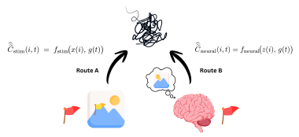

# Where does complexity live?

**A cross-level bridge for measuring task-specific visual complexity**

Sabrina Patania†, Riccardo Chimisso†, Francesco Uccelli, Valentyn Piskovskyi,
Marco Fagnani, and Dimitri Ognibene

Department of Psychology, University of Milan-Bicocca, Italy. † Equal contribution.

Companion code for the manuscript submitted to the *International Journal of Computer Vision*.
The study measures how difficult it is to find a particular object in an image, then predicts that
image-target complexity from visual features and brain activity.

## Scientific workflow

[Complexity](complexity/README.md) converts human or generated scanpaths into trial tables, fits hierarchical
measurement models, and exports posterior-mean difficulty rankings. [Route A](route_a/README.md) predicts
these scores from the image and target. [Route B](route_b/README.md) predicts them from fMRI, subject identity
and target conditioning. Route B uses image features as encoder-training supervision.

The NSD fMRI was collected during image viewing. The search target is supplied separately to the readout.



*Figure 2: the paper's two complexity readout routes.*

## Repository layout

| Component | Responsibility |
| --- | --- |
| [complexity/](complexity/README.md) | Scanpath preparation, statistical models, ranking export and variance. |
| [route_a/engineered/](route_a/engineered/README.md) | DINO-small, CLIP and detector features with XGBoost. |
| [route_a/embedding/](route_a/embedding/README.md) | DINO-large and CLIP embeddings with a target-conditioned neural head. |
| [route_b/](route_b/README.md) | fMRI preprocessing, encoder pretraining, complexity readout and objective sweep. |
| [shared/](shared/README.md) | Data, feature, conditioning and metric helpers used by embedding Route A. |

Each component README describes its workflow, inputs, commands, outputs and paper targets.
Large input data, extracted features, fitted preprocessing and checkpoints belong outside the checkout.

## Installation and commands

Use Python 3.12 on Linux for the recorded environments. Package metadata supports Python 3.11 or newer.
Choose a component extra and its matching `requirements.lock.txt`; the component instructions provide
complete installation commands. Keep the Bayesian, neural and ScanDiff environments separate.

For example, from the repository root:

```bash
python3.12 -m venv .venv-complexity
source .venv-complexity/bin/activate
python -m pip install -c complexity/requirements.lock.txt '.[complexity]'
python -m complexity --help
```

| Workflow | Module entry point | Equivalent console command |
| --- | --- | --- |
| Measurement | `python -m complexity run --config CONFIG --profile nsd` | `complexity run ...` |
| Engineered stimulus predictor | `python -m route_a.engineered train ...` or `predict ...` | `route-a-engineered ...` |
| Embedding stimulus predictor | `python -m route_a.embedding train ...` | `route-a-embedding ...` |
| Brain readout | `python -m route_b run --config CONFIG` | `route-b run ...` |
| Brain prediction | `python -m route_b predict ...` | `route-b predict ...` |
| Brain backbone weights | `python -m route_b download-models` | `route-b download-models` |

Embedding Route A also provides `extract-features`, `evaluate-global` and `evaluate-per-subject`.
Use `--help` after any subcommand to see its inputs. Options use kebab-case; JSON fields use snake-case.
Configured paths expand environment variables and `~`, then resolve relative to the JSON file's directory.
CLI paths resolve relative to the launch directory. Component-specific CSV image resolution is documented
with its schema.

## External data, models and outputs

The workflows use [COCO-Search18](https://sites.google.com/view/cocosearch/),
[MS-COCO](https://cocodataset.org/#download), and the
[NSD](https://www.naturalscenesdataset.org/) data packaged for
[Algonauts 2023](https://algonautsproject.com/2023/challenge.html#challenge-data).
Use the component input schemas and original image identities when preparing these inputs.

The fixed [NSD ranking](complexity/nsd_m2_ranking.csv) supplies the released image-target labels.
It contains 12,447 ranking rows; a ranking row, a physical image and a subject-level observation are
separate units. Repeated records are retained where the component workflow uses them.

DINOv2, OpenCLIP, Faster R-CNN and ScanDiff requirements are documented with their consumers.
`TORCH_HOME` and `HF_HOME` control model-weight caches; extracted-feature locations are separate command
or configuration paths. Train predictor checkpoints and generate run outputs in external directories.
Compact paper-result CSVs reside inside Complexity and Route B.

## Development

Use two-space indentation, UTF-8, LF endings, a final newline, no trailing whitespace and a 127-character
line limit. Prefer single-quoted ordinary strings; double quotes can avoid escaping. Keep imports sorted
in standard-library, third-party and local groups, preserving initialization order where required.
Use ordinary hyphens in prose and comments. [EditorConfig](.editorconfig) supplies the basic editor settings.

Write valid reStructuredText docstrings: double backticks for inline code, Sphinx field lists for documented
parameters and returns, and literal blocks for examples. Docstrings are optional; annotate all function
parameters and returns. Use concrete containers and narrow interfaces, keeping justified `Any` local to
library or serialization boundaries. Mathematical variable names may follow the experiment.

These are review conventions. There are no formatter, linter, type-checker or style-validation dependencies.
To edit a component, install its extra with `-e` and add the `dev` extra for pytest. Run the relevant checks
in that component's environment:

```bash
# Measurement environment
python -m unittest discover -s complexity/tests -v
# Engineered environment with the dev extra
python -m pytest route_a/engineered/tests -q
# Embedding environment
python -m unittest discover -s route_a/embedding/tests -v
# Route B environment
python -m unittest discover -s route_b/tests -v
```

These bounded checks exercise schemas, populations, command dispatch, saved formats, scoring and recovery.
They do not launch full scientific experiments. Retain operation order, RNG use and checkpoint schemas
when refining scientific code. Resume checks intentionally reject source, settings or input changes.

## Paper and citation

Sabrina Patania, Riccardo Chimisso, Francesco Uccelli, Valentyn Piskovskyi, Marco Fagnani, and Dimitri Ognibene.
*Where does complexity live? A cross-level bridge for measuring task-specific visual complexity.*
Manuscript submitted to the *International Journal of Computer Vision*.
