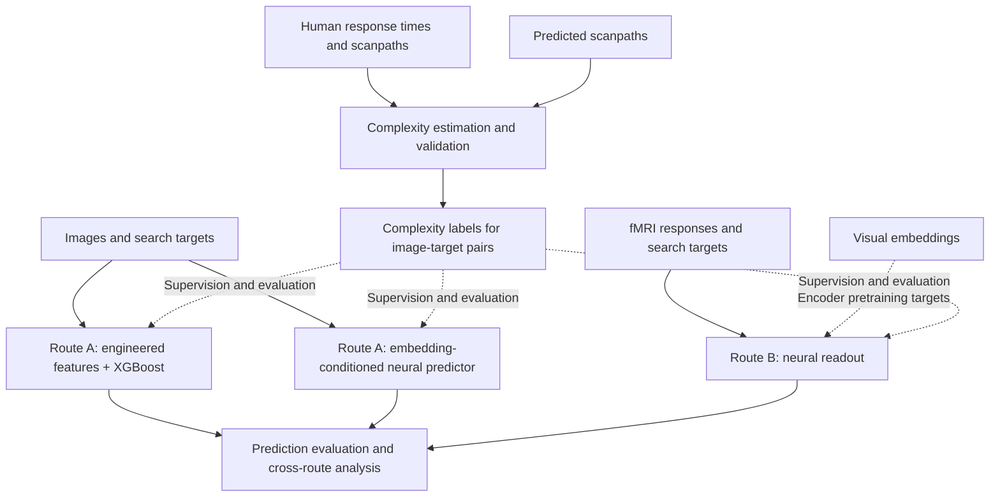

# Where does complexity live?

**A cross-level bridge for measuring task-specific visual complexity**

Sabrina Patania†, Riccardo Chimisso†, Francesco Uccelli, Valentyn Piskovskyi,
Marco Fagnani, and Dimitri Ognibene

Department of Psychology, University of Milan-Bicocca, Italy

† Equal contribution

Companion research repository for the manuscript submitted to the
*International Journal of Computer Vision (IJCV)*.

## Overview

How difficult is it to find a particular object in an image? The answer depends on
both the scene and the search target. This work studies visual search complexity
as a property of **image-target pairs**, grounded in human search behaviour, and
asks how that complexity is reflected in eye movements, image representations,
and brain activity.

Starting from human response times and fixation counts in COCO-Search18, we
estimate a target-conditioned complexity index using hierarchical statistical
models. We assess the stability of the resulting difficulty rankings and examine
whether predicted scanpaths can provide a scalable substitute for human gaze.
We then investigate two routes for predicting the resulting complexity scores:

- **Route A - stimulus readout:** predict complexity from image content and the
  search target, using either engineered features with XGBoost or a neural
  predictor operating on DINOv2 and CLIP embeddings.
- **Route B - neural readout:** predict complexity from Natural Scenes Dataset
  (NSD) fMRI responses and the search target, using an encoder pretrained to
  predict visual embeddings and a target-conditioned complexity head.

The fMRI responses were recorded during viewing of the images; the search target
is supplied separately to the predictor. This distinction matters when
interpreting neural readout of task-specific complexity.


*Figure 2 from the paper: complexity readout routes. Both routes condition their
prediction on the search target.*

## Repository status

This repository is being prepared as the cleaned research code release for the
paper. The [complexity component](complexity/README.md) provides a configurable
pipeline, the image-to-ranking flow, pinned fitting dependencies, ScanDiff
integration, and the preserved NSD ranking used by Route B. Its
[validation record](docs/complexity_validation.md) distinguishes deterministic
replay, model refitting, and inference smoke tests. The
[Route B component](route_b/README.md) preserves the original implementation with
configurable paths, checkpoint replay checks, and resumable training. Its
[reproduction guide](docs/route_b_reproduction.md) separates equivalence to saved
paper artifacts from fresh training reproduction.
Route B now has a standalone public workflow. See its
[data and model sources](docs/route_b_data.md), [artifact guide](docs/route_b_artifacts.md),
and [completed reproduction results](docs/route_b_results.md).
The engineered and embedding Route A implementations are available in their component folders.

## Scientific workflow


```mermaid
flowchart TD
    H["Human response times and scanpaths"] --> C["Complexity estimation and validation"]
    G["Predicted scanpaths"] --> C
    C --> L["Complexity labels for image-target pairs"]
    I["Images and search targets"] --> A1["Route A: engineered features + XGBoost"]
    I --> A2["Route A: embedding-conditioned neural predictor"]
    N["fMRI responses and search targets"] --> B["Route B: neural readout"]
    V["Visual embeddings"] -.->|Encoder pretraining targets| B
    L -.->|Supervision and evaluation| A1
    L -.->|Supervision and evaluation| A2
    L -.->|Supervision and evaluation| B
    A1 --> E["Prediction evaluation and cross-route analysis"]
    A2 --> E
    B --> E
```

Visual image embeddings anchor Route B during encoder pretraining. At inference,
its complexity prediction uses fMRI, subject identity, and target conditioning.

## Repository structure

```text
where-does-complexity-live/
├── README.md
├── complexity/
│   ├── README.md
│   └── ...                  # Complexity estimation, rankings, and validation
├── route_a/
│   ├── README.md
│   ├── engineered/
│   │   ├── README.md
│   │   └── ...              # Engineered features and XGBoost
│   └── embedding/
│       ├── README.md
│       └── ...              # Embedding-conditioned predictor (Fig. 5)
├── route_b/
│   ├── README.md
│   └── ...                  # fMRI preprocessing, pretraining, and readout
├── shared/
│   └── ...                  # Reused data, embedding, model, and evaluation code
├── analysis/
│   ├── README.md
│   └── ...                  # Cross-route comparisons and variance analysis
└── docs/
    └── ...                  # Data setup, reproduction, and code conventions
```

| Component | Purpose and relation to the paper |
| --- | --- |
| `complexity/` | Prepare behavioural and predicted-gaze data, fit complexity models, generate labels, and evaluate ranking stability. |
| `route_a/engineered/` | Implement feature-based stimulus prediction (§5.5.1), feature comparisons, and the related fMRI augmentation experiments (§5.6). |
| `route_a/embedding/` | Implement embedding-conditioned stimulus prediction (§5.6.1, Fig. 5), including its feature-family experiments. |
| `route_b/` | Implement the fMRI pipeline (§5.7, Fig. 7) and its encoder-objective experiments (Fig. 9). |
| `shared/` | Hold code reused across components, such as embedding extraction, target conditioning, split utilities, and metrics. |
| `analysis/` | Compare route outputs and quantify recovery of target-driven variance (§5.8). |
| `docs/` | Document data preparation, reproducibility, and development conventions. |

The Fig. 5 pipeline belongs to Route A because it predicts from image embeddings.
It shares conditioning and uncertainty modelling with Route B, providing a
comparable stimulus-based counterpart to the neural readout.

Each component README will describe its scientific purpose, required inputs,
produced outputs, and commands for reproducing the corresponding paper results.
Experiment-specific configurations and ablations will live with their owning
component; reusable implementations will live in `shared/`.

## Data and reproducibility

The study uses COCO-Search18, MS-COCO, and NSD. Data-access and preparation
instructions will accompany the released pipelines. Large datasets, extracted
embeddings, and model checkpoints will be stored separately from source code.

Reproduction instructions will identify the configuration, random seeds, image-ID
splits, and expected outputs for each experiment. The paper describes training-only
preprocessing and exclusion of held-out complexity images from Route B encoder
pretraining. The recovered implementation differs in preprocessing, pretraining
splits, and category-mean handling. The
[Route B inventory](docs/route_b_inventory.md#protocol-discrepancies-requiring-an-explicit-decision)
records these differences; historical reproduction and protocol corrections must
be evaluated separately.

## Development

See the [Python code style guide](docs/code_style.md) for formatting, reST
docstrings, typing, and imports. [EditorConfig](.editorconfig) supplies basic
whitespace settings for compatible editors; the remaining conventions are
documented for authors and reviewers.

The [complexity code inventory](docs/complexity_inventory.md) maps the existing
research code to the manuscript and records provenance and deferred decisions.
The [complexity README](complexity/README.md) documents the full flow, inputs,
commands, model settings, and output checks.
The [Route B inventory](docs/route_b_inventory.md) maps its source files and
saved checkpoints to the paper, and the [Route B README](route_b/README.md)
documents the input-to-prediction flow.

## Paper and citation

**Where does complexity live? A cross-level bridge for measuring task-specific
visual complexity.** Sabrina Patania, Riccardo Chimisso, Francesco Uccelli,
Valentyn Piskovskyi, Marco Fagnani, and Dimitri Ognibene. Manuscript submitted to
*International Journal of Computer Vision*.

A public paper link and machine-readable citation will be added when available.

## Engineered Route A code

The [engineered Route A package](route_a/engineered/README.md) provides training
and prediction for image and search target pairs. Its guide covers installation
and usage; [data setup](docs/data_setup.md) covers the required inputs.

## Install the integrated package

Use Python 3.12 for the documented environments. The package requires Python 3.11 or newer.
Install the component dependencies before installing the local package:

```bash
# Engineered Route A, including pretrained feature extraction.
python -m pip install -e '.[engineered,dev]'
# Embedding Route A.
python -m pip install -e '.[embedding]'
```

For Complexity and Route B, use their separate dependency specifications and environments
as described in their READMEs, then run `python -m pip install --no-deps -e .` from the repository root.
The distribution includes all four source packages and their runtime CSV/configuration resources.
The contributed commands remain `complexity-route-a` and `complexity-route-a-embedding`;
Complexity and Route B retain their documented `python -m` commands.
