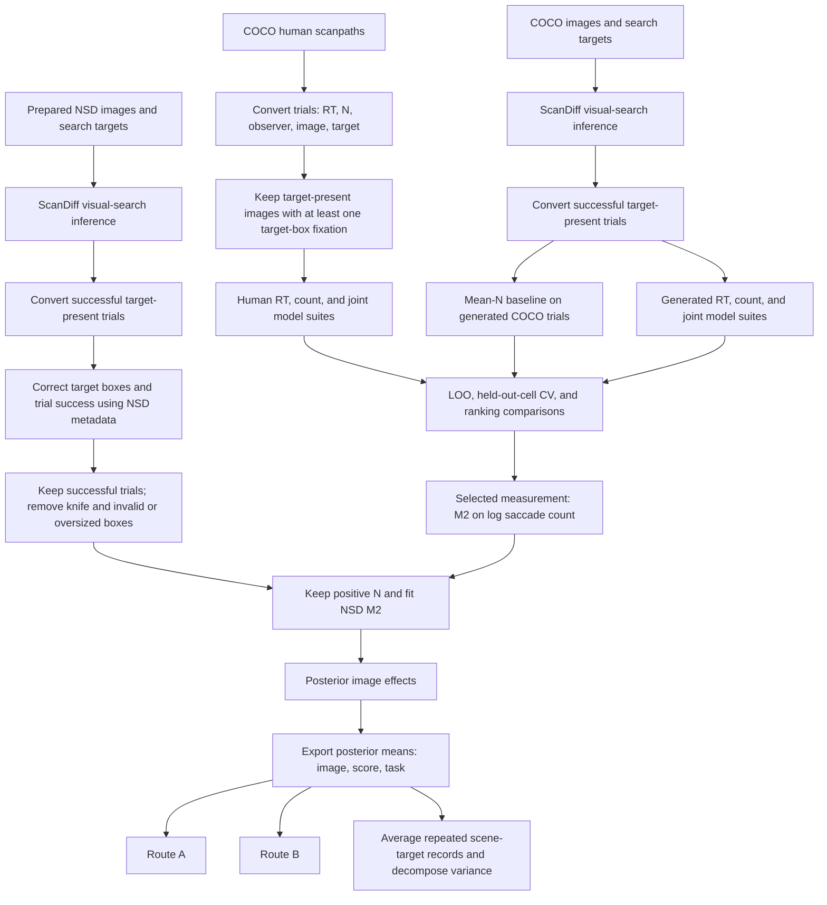

# Behavioural complexity estimation

For the subsequent RT provenance findings, successful-trial protocol, and corrected
CV investigation, see the [revised comparison](../docs/complexity_corrected_protocol.md).
The reproduction results below describe the earlier historical run.

This component estimates visual-search complexity from human and generated
scanpaths. COCO-Search18 supports the measurement-model comparisons. Applying the
selected M2 count model to ScanDiff predictions for NSD produces the complexity
labels consumed by Routes A and B.

The pipeline accepts explicit data paths, runs the complete model registries,
and records sampling settings and diagnostics. Large datasets, checkpoints, and
run outputs are external to this repository. The preserved
[Route B reference](reference/nsd_m2_ranking.csv) contains 12,447 rows across
16 target categories.

The complete image-generation and fitting run finished on 12 September 2026.
Saved NSD scanpaths reproduce the preserved ranking exactly. Fresh NSD generation
changes 27 label memberships, so its final verification fails despite close score
agreement. COCO count tables largely reproduce; RT tables and several alternative
models have unresolved historical-result or convergence differences. See the
[investigation](../docs/complexity_discrepancies.md) for the current evidence and
the corrected joint-model LOO scoring. Use the preserved reference for Route B.

## Flow



Inference can be skipped when replaying the saved scanpath JSONs. This is the
entry point for checking historical outputs without introducing new stochastic
ScanDiff predictions. Regeneration from images is a separate selectable stage.

### Measurements and filters

- `RT` comes from the scanpath record. ScanDiff records it as the sum of predicted
  fixation durations in milliseconds.
- `N` is the number of saccades: fixation count minus one. The count models and
  Mean-N baseline require `N > 0`; the RT models require positive RT and apply
  their original count-validity checks.
- Human COCO inclusion follows the paper's detectable-image rule: at least one
  observer's scanpath must intersect a target box. All target-present trials for
  qualifying image filenames are retained, including unsuccessful observers.
  With the supplied human JSON, all 2,241 filenames qualify, retaining 24,880
  trials. This is different from filtering by the stored `correct` flag alone.
- Mean-N uses the successful generated COCO trials, matching the historical
  `merged_correct.csv` input. Its ranking is compared with human M2-RT in
  Figure 3b. Human model inputs and the generated successful-trial filter are unchanged.
- NSD correction preserves the original 425 by 425 coordinate transform,
  first matching usable category box, knife exclusion, box-area limit of 90%,
  and boundary checks. Saved inputs yield 83,508 corrected trials; positive-N
  filtering leaves 82,221 observations and 12,447 ranked filenames.
- Image-effect identity and ranking joins retain the historical filename keys.
  Target grouping is not changed in this release. See the
  [inventory](../docs/complexity_inventory.md) for the deferred correction.
- A larger exported score means greater estimated difficulty. The score is the
  posterior mean of `img_re`, or `C_image` for joint models. It is not a raw
  saccade count or a normalized percentile.

## Installation and inputs

Use Python 3.12. The pinned [requirements](requirements.txt) record the tested
fitting environment, including PyMC 5.27.0 and ArviZ 0.23.0. A C++ compiler is
needed for the normal PyTensor backend.

```bash
python3.12 -m venv .venv
.venv/bin/python -m pip install -r complexity/requirements.txt
```

Set these paths before using [config.example.json](config.example.json):

```bash
export COMPLEXITY_DATA=/path/to/saved/complexity/data
export BRAIN_DATA=/path/to/brain_activation
export COMPLEXITY_OUTPUT=/path/to/a/new/run
```

`COMPLEXITY_DATA` must contain the human COCO JSON, generated COCO JSON, and
`nsd_all_scanpaths.json`. `BRAIN_DATA` supplies the prepared image trees,
bounding-box JSONs, and full `nsd_augmentation_data/metadata.json`. The small
metadata sample cannot replace the full file. See the config for exact filenames.

Use a fresh output directory. The NSD posterior alone occupies several GB;
full COCO suites require additional space. Inputs are read without modification.
Environment variables can be replaced with absolute paths in a private config.
Commands below run from the repository root.

## Run the NSD label flow

```bash
.venv/bin/python -m complexity.run \
  --config complexity/config.example.json --profile nsd
```

This converts saved scanpaths, corrects NSD targets, fits M2, exports the ranking,
computes variance, and verifies the ranking against the preserved Route B labels.
Defaults are four chains, 2,000 tuning steps, 2,000 draws, seed 42, and target
acceptance 0.95. The manuscript specifies this target acceptance and the sampling
counts; seed 42 is an explicit reproduction choice. Chain count, tuning length,
retained draws, and main package versions were also recovered from the historical
posterior. NSD does not rerun the COCO model-selection experiment.

To replay only deterministic stages using an existing posterior:

```bash
.venv/bin/python -m complexity.run \
  --config complexity/config.example.json --profile nsd \
  --stages prepare export variance verify \
  --posterior /path/to/results_nsd_no_knife/M2_n_studentT.nc
```

The supplied posterior must match the input trial table and reference label set.
A historical posterior and a fresh refit use different verification criteria.

## Run COCO model comparisons

```bash
.venv/bin/python -m complexity.run \
  --config complexity/config.example.json --profile coco
```

The count suite enables M1-M4. The RT suite enables M1-M4 and all five joint
variants. Both human and generated tables are fitted. The runner computes LOO
and five-fold cell-held-out CV with 600 draws, 600 tuning steps, and two chains
per fold. These are explicit reproduction settings, not verified historical CV
settings. The baseline uses the generated COCO table and is saved under
`rankings/predicted_mean/`. Comparisons use human M2-N for
Figure 4a, matching the recovered plotted result and the author's planned caption
correction. Other figure comparisons are identified explicitly in `run.py`.

The baseline input follows the author's decision to reproduce the historical
experiment. New results are saved separately. The completed full run establishes
execution of every suite, with numerical and convergence limits documented in the
[investigation](../docs/complexity_discrepancies.md).

Joint RT LOO integrates over the model's predicted count with at least 20 Monte
Carlo samples, restoring the original research entry point's marginal scoring.
The first full migrated run omitted that preparation step. Its five joint-model
LOO rows per RT suite are superseded by separate rescoring artifacts; fitted
posteriors, CV results, and complexity rankings are unaffected by this correction.
To rescore a completed RT suite without refitting or replacing its artifacts:

```bash
.venv/bin/python -m complexity.evaluation.rescore_rt_loo \
  --results-dir /path/to/completed/coco_human_rt \
  --csv /path/to/its/trials/human.csv \
  --output-dir /path/to/new/marginal_loo
```

The scorer verifies the recorded input and scientific source hashes, reuses the
recorded seed and count-integration setting, and records posterior hashes. Use
this command for the archived run; normal `--resume` correctly rejects its old
runner hash after the scoring correction.

Individual suites also expose `--models` for shorter investigations:

```bash
.venv/bin/python -m complexity.models.fit_movement_count \
  --csv /path/to/trials.csv --results-dir /path/to/new/results \
  --models M1_n_lognormal M2_n_studentT --skip-cv
```

For pipeline subsets, add `coco_models` to the config with `rt` and `count` lists
of full model names. Comparisons require both M2 variants. The `--stages` option
selects stages; they always execute in pipeline order. `--resume` permits model
checkpoint reuse only when recorded source, input hash, packages, and settings
match. Errors stop the pipeline and remain visible in its stage logs.

## Regenerate scanpaths from prepared images

ScanDiff remains an external dependency. The
[generation adapter](generation/generate_scanpaths.py) uses its model source,
Hydra configs, visual-search checkpoint, task embeddings, and DINOv2 backbone.
It preserves the recovered inference calculations while removing the broken
plotting call and making input, output, device, and seed explicit.

Create a separate environment with [generation requirements](generation/requirements.txt).
Supply the recovered ScanDiff checkout, including `src/`, `configs/`,
`checkpoints/scandiff_visualsearch.pth`, and `data/task_embeddings.npy`. DINOv2
weights must be cached or downloadable at first use.

```bash
python3.12 -m venv .venv-scandiff
.venv-scandiff/bin/python -m pip install -r complexity/generation/requirements.txt
export SCANDIFF_ROOT=/path/to/ScanDiff
export SCANDIFF_PYTHON="$PWD/.venv-scandiff/bin/python"
.venv/bin/python -m complexity.run \
  --config complexity/config.example.json --profile nsd \
  --stages generate prepare fit export variance verify
```

The adapter produces ten scanpaths per image-target input, uses 1,000 diffusion
steps, and processes sorted input paths with seed 1000 by default. It runs one
process per entry in `generation.devices`, with four entries in the example
configuration. The author confirmed four historical GPUs and recalled using
`--force`. The sorted inputs are partitioned into contiguous chunks of size
`ceil(N / 4)`, with worker seeds 1000, 1001, 1002, and 1003. Repeated device
entries allow independent workers to share a physical GPU without changing
their partitions or seeds. Changing the number of workers changes the experiment.
The `generation.profiles.coco` override selects one float32 worker for COCO;
NSD uses four mixed-precision workers. These dataset-specific settings follow
the historical output timestamps and numerical checks described in the run record.

Each worker records its settings, progress, and Python, NumPy, CPU Torch, and
CUDA random states after each input. `--resume` restores the completed prefix
and its random state. An image written just before interruption is recomputed
and checked against the saved output. Unreadable images are logged and skipped
before sampling, as in the original generator. They remain in the partition
list. Five such files explain the difference between 52,486 prepared NSD inputs
and 52,481 historical outputs. Empty per-image JSON lists mark skipped inputs;
`skipped_images.json` records their errors. Other inference failures stop the run.

The [full reproduction record](../docs/complexity_full_reproduction.md) documents
the isolated environments and controlled original-versus-adapter checks.
`--limit` is available for small inference tests when invoking the adapter
directly. Partial generation must not be used as a complete publication dataset.

## Outputs and validation

| Location within a run | Contents |
| --- | --- |
| `trials/` | Converted tables, selected human trials, corrected NSD trials, selection counts |
| `nsd_fit/` | NSD M2 posterior, settings, progress manifest, sampling diagnostics |
| `coco_{human,predicted}_{rt,count}/` | COCO posteriors, LOO tables, CV summaries and model-selection tables |
| `rankings/` | Sorted `image,score,task` CSVs and score-distribution plots |
| `comparisons/` | Ranking-comparison summaries and plots |
| `logs/` | Exact stage commands and their output, including the variance decomposition |
| `verification.json` | Label identity, ranking agreement, tolerances and pass/fail result |

Deterministic export requires identical labels, target mapping, and ordering,
with maximum score error at most `1e-12`. A fresh fit requires identical label
and target sets, Spearman correlation at least 0.99, score RMSE at most 0.02,
zero divergences, maximum image-effect R-hat at most 1.01, and minimum bulk and
tail ESS of 400. These are declared reproduction criteria; passing them does
not establish equivalence of every possible downstream statistic.

```bash
.venv/bin/python -m unittest discover -s complexity/tests -v
```

These are scientific regression tests, not code-style tooling. The
[validation record](../docs/complexity_validation.md) records the actual runs,
including any limitations. The [source manifest](source_manifest.json) keeps
original and current hashes. Model equations, priors, and core CV calculations
remain in the original research functions; their broader style cleanup is
separate from these execution changes.
