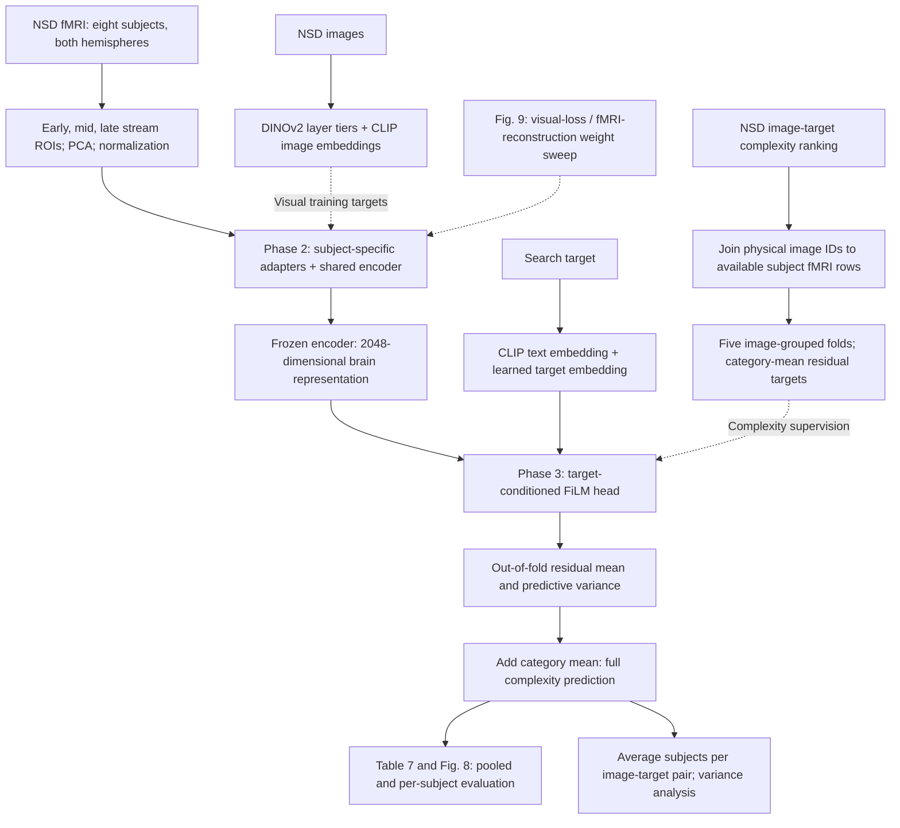

# Route B: neural readout of target-conditioned complexity

Route B predicts image-target complexity from NSD fMRI responses, subject
identity, and a search target. An encoder first learns to predict visual image
representations from brain activity. A target-conditioned head then learns to
predict the complexity labels produced by the [complexity pipeline](../complexity/README.md).

The fMRI was recorded during image viewing. The target is supplied to the model
separately; these are not fMRI recordings of the target-specific search task.

## Getting started

The public pipeline supports feature extraction, PCA, encoder pretraining, head
training, saved-model evaluation, and prediction. It requires no original research
repository. Start with the [data and model guide](../docs/route_b_data.md), then
follow [installation and commands](../docs/route_b_reproduction.md).

This component preserves the **original implementation used to produce the reported
results**. All five saved-checkpoint comparisons produced identical predictions.
Fresh training results are recorded in the [release report](../docs/route_b_results.md).
The [source inventory](../docs/route_b_inventory.md) documents the recovered protocol
differences. The release retains [compact scientific records](../docs/route_b_artifacts.md).
Trained predictors, fitted preprocessing, and embeddings are generated locally;
datasets and upstream model weights are obtained from their public sources.

## Identified flow

The diagram describes the recovered stages. In particular, the historical
pretrained encoder is shared across the five complexity folds, and the saved
evaluation uses a single category-mean lookup. See the inventory for the
consequences of those choices.

1. **Build the supervised records.** Read the preserved NSD ranking, keep
   `train-` records, and associate each physical NSD image with its available
   fMRI rows across subjects. This gives 12,108 ranking records, representing
   9,990 physical images and 11,304 distinct image-target pairs. Repeated
   records are retained by the historical training pipeline.
2. **Prepare visual supervision.** Extract all 24 DINOv2 ViT-L/14 layer CLS
   vectors and average them into early, middle, and late tiers, each with 1,024
   dimensions. Extract 768-dimensional CLIP image embeddings. Separately,
   average CLIP text embeddings from five prompts for each of the 16 targets.
3. **Prepare fMRI.** Combine hemispheres, select early, middle, and late visual
   stream ROIs, and fit 2,048 PCA components per tier and subject. Concatenate
   them into a 6,144-dimensional representation and standardize it.
4. **Pretrain the encoder.** Subject-specific adapters and a shared network
   map the fMRI representation to a 2,048-dimensional latent representation.
   Projection heads predict the three DINOv2 tiers and CLIP image embedding,
   using cosine, mean-squared-error, and contrastive losses.
5. **Train the complexity head.** Keep the encoder frozen. Condition a FiLM
   head on the target's CLIP text vector and learned target embedding. Predict
   the category-mean residual and its log variance with a Gaussian likelihood
   objective. Train five heads with image-grouped, target-stratified folds.
6. **Evaluate held-out predictions.** Apply each fold's model to its held-out
   records, restore the category mean, and pool the resulting 18,736
   subject-level observations. Compute full-score and residual correlations,
   errors, uncertainty summaries, and per-subject results. This is pooling
   out-of-fold predictions, not averaging five models for each example.
7. **Run the related analyses.** Figure 9 repeats encoder pretraining and head
   training while varying visual supervision versus fMRI reconstruction. The
   cross-route variance analysis averages subjects for each image-target pair
   and measures within-image and between-image variance.

## Inputs and outputs

Required research inputs are the NSD/Algonauts 2023 images, subject fMRI arrays,
visual-stream ROI masks, the preserved
[`nsd_m2_ranking.csv`](../complexity/reference/nsd_m2_ranking.csv), and the
DINOv2 and CLIP pretrained weights. Derived PCA models, feature arrays, and
Route B checkpoints remain external data artifacts.

At inference, the predictor needs fMRI, subject identity, target conditioning,
the fitted preprocessing, model weights, and category means. DINOv2 and CLIP
**image** embeddings provide training supervision; they are not required to
predict complexity from a new fMRI observation.

The identified saved baseline matches Table 7: Pearson 0.6125, Spearman 0.5675,
MAE 0.1752, and R² 0.3729. Saved-checkpoint replay matches these values exactly. The completed fresh baseline
has Pearson 0.6074; all fresh results are reported separately.

## Component boundaries

This directory owns fMRI preprocessing, visual pretraining, the complexity head,
prediction, evaluation, and the Figure 9 experiments. Its prediction variance code
is retained; ground-truth decomposition reuses the existing complexity analysis.
Figure 5 belongs to `route_a/embedding/`.

| Directory | Responsibility |
| --- | --- |
| `data/` | NSD alignment, original datasets, visual stream ROIs, and PCA |
| `features/` | DINOv2 and CLIP extraction |
| `models/` | Encoder, projection heads, FiLM head, and losses |
| `training/` | Original optimization with optional epoch recovery |
| `evaluation/` | Inference, metrics, reports, and prediction variance |
| `experiments/` | Explicit settings and source-to-port mapping |
| `tests/` | Scientific equivalence, standalone usage, and recovery tests |
| `development/` | Optional original-workspace comparisons and historical run records |
| `reference/` | Compact results and model artifact manifest |

Existing model packages load without conversion because state dictionary keys and
tensor shapes are preserved. Model training retains its original operation order,
including auxiliary forward computations at zero loss weight and dropout in the
frozen encoder. Original training calls bypass the DataParallel wrapper, so the
underlying model computes on the first configured GPU.

The command interface is `python -m route_b.run --config CONFIG.json --stages STAGES --resume`.
Start from [the example configuration](experiments/paper.example.json). The controller
runs only the requested public stages. Original-versus-ported comparisons remain
available separately through `--verify-original` for developers with the preserved
research workspace.
